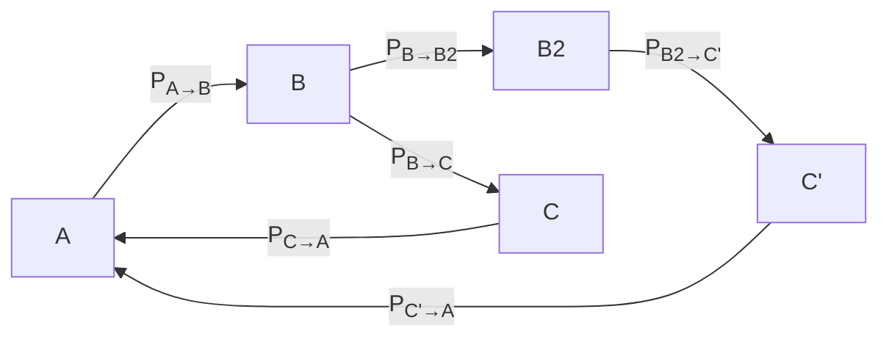

# Graph / navigation

Transition probabilities:

| From \ To | A                      | B                     | B2                     | C                      | C'                      |
| --------- | ---------------------- | --------------------- | ---------------------- | ---------------------- | ----------------------- |
| **A**     | 0                      | PA→B = 1.0 | 0                      | 0                      | 0                       |
| **B**     | 0                      | 0                     | PB→B2 = 0.5 | PB→C  = 0.5 | 0                       |
| **B2**    | 0                      | 0                     | 0                      | 0                      | PB2→C' = 1.0 |
| **C**     | PC→A = 1.0  | 0                     | 0                      | 0                      | 0                       |
| **C'**    | PC'→A = 1.0 | 0                     | 0                      | 0                      | 0                       |

And probability of reward:

P_C' = 1.0
P_C = 0.0
P_A = 1.0
P_B = P_B2 = 0.0

Add A-Cs (this is cool but it tests if the animal knows anything bout a ranodm "C" should be 50/50 but def different from either 0 or 1)
Add Cs to B. This would be cool since it would prevent animals from using the "A" information and instead rely on some teleport to a random location sort of thing.

| From \ To | A                      | B                     | B2                     | C                      | C'                      |
| --------- | ---------------------- | --------------------- | ---------------------- | ---------------------- | ----------------------- |
| **A**     | 0                      | PA→B = 0.8 | 0                      | 0.1                    | 0.1                     |
| **B**     | 0                      | 0                     | PB→B2 = 0.5 | PB→C  = 0.5 | 0                       |
| **B2**    | 0                      | 0                     | 0                      | 0                      | PB2→C' = 1.0 |
| **C**     | PC→A = 1.0  | 0                     | 0                      | 0                      | 0                       |
| **C'**    | PC'→A = 1.0 | 0                     | 0                      | 0                      | 0                       |